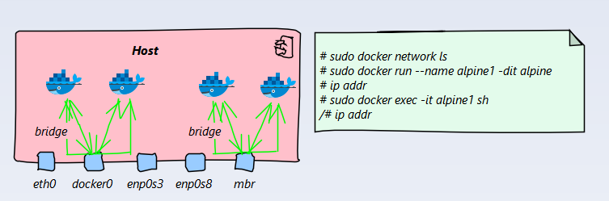
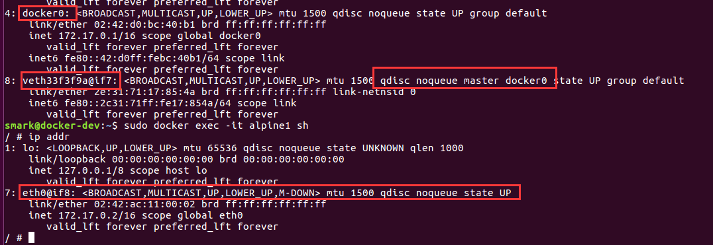
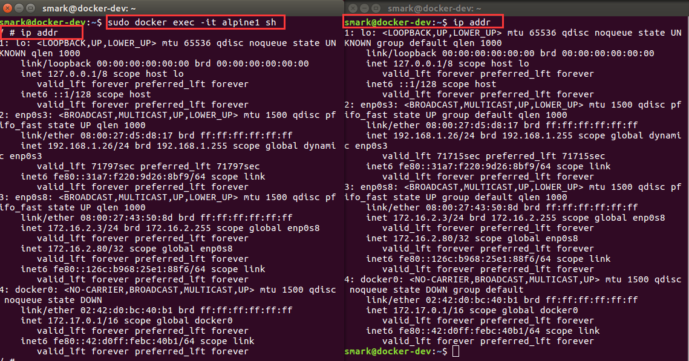
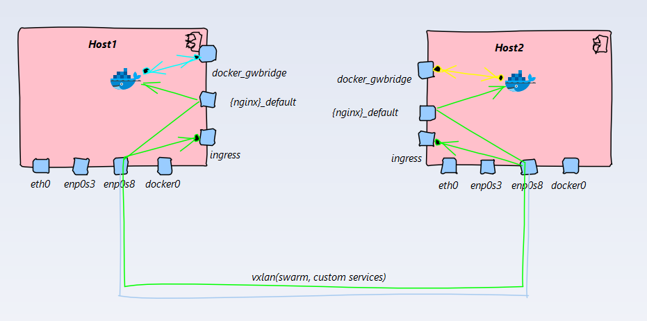

[Home](/) > [网络](network/)
# Docker 网络
Docker 网络基于Linux 提供的网络技术支持，本文会分析docker网络模型和具体的实现方法
## Bridge
docker 使用基于软件实现的bridge运行连接到同一个bridge的容器之间进行通信，隔离没有与对应bridge连接的网络，安装docker后会默认创建一个`docker0` bridge，而默认启动的容器没有知道`--network`的情况下都连接到`docker0`上
自定义的`bridge`和默认的`bridge`会有些不同
* 连接在同一个用户定义的`bridge`上的容器默认所有的端口都是互相暴漏的，但并不对外暴露端口，容器的交互会更加容易
* 用户定义的`bridge`会在容器之间提供自动的DNS功能，
* 连接在用户自定义`bridge`上的容器可以随时连接或移除网络接口，而默认的`bridge`需要停掉容器
* 用户定义的`bridge`是可配置的

**Docker bridge默认基于linux的 `VETH` 实现**

## Host
连接在`host`网络上的容器完全使用宿主主机的网络栈，容器开启的端口会直接在宿主主机上暴露

连接在`host`网络上的容器完全使用宿主主机的网络栈

## Macvlan
Docker提供macvlan网络模式是为了解决一些遗留系统的问题，如果能用`bridge`或`overlay`网络解决尽量用，推荐尽量用这两个网络模型，docker中的`macvlan`和linux中的`macvlan`行为一致,详细参见 [Linux Macvlan Network](network/linux#macvlan) 和 [Docker Macvlan Network](https://docs.docker.com/network/macvlan/)
## Overlay

## 参考

* [Docker Network](https://docs.docker.com/network/)
