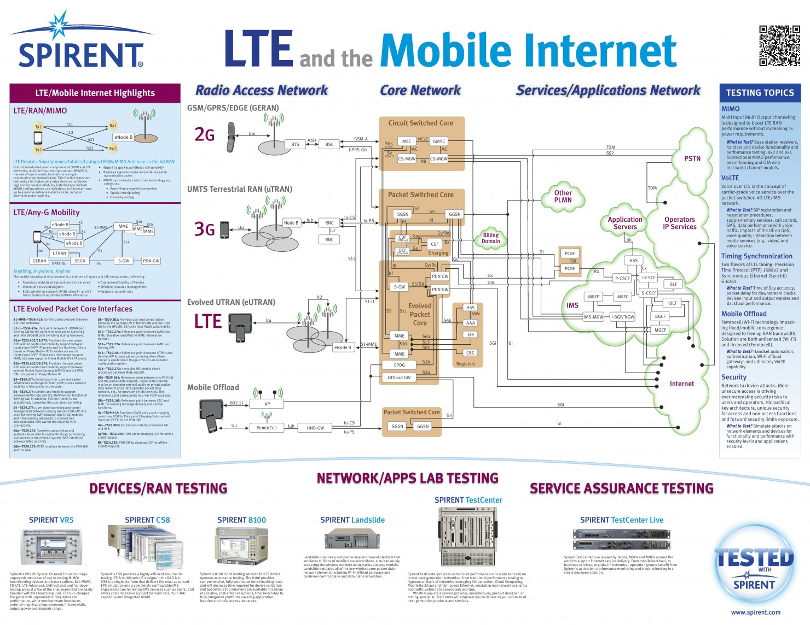
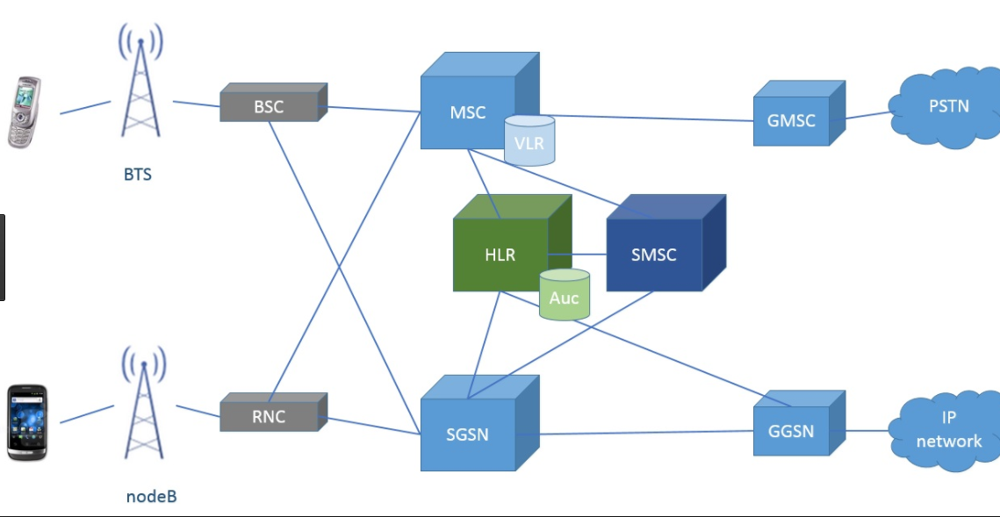
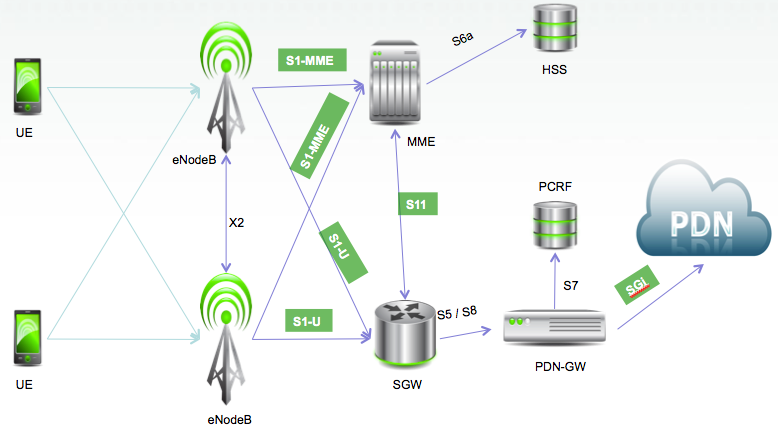
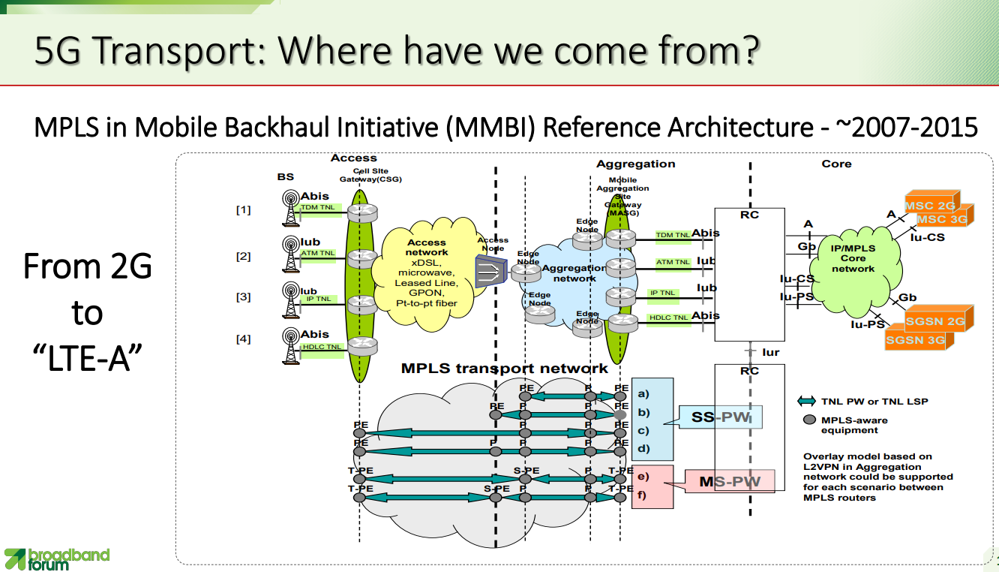
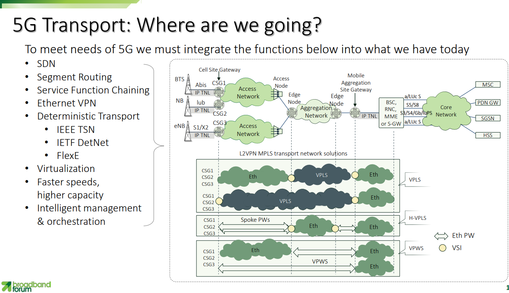

[Home](/) > [网络](network/)
# 运营商网络
`声明：部分图片来自于网络，如果看不清可以直接右键打开`

## 2G-3G

## 4G LTE

## 5G

## 参考
* [5G Convergence (ITU)](https://www.itu.int/en/ITU-T/Workshops-and-Seminars/201807/Documents/4_Manuel_Paul.pdf)
* [3GPP](https://www.3gpp.org/)