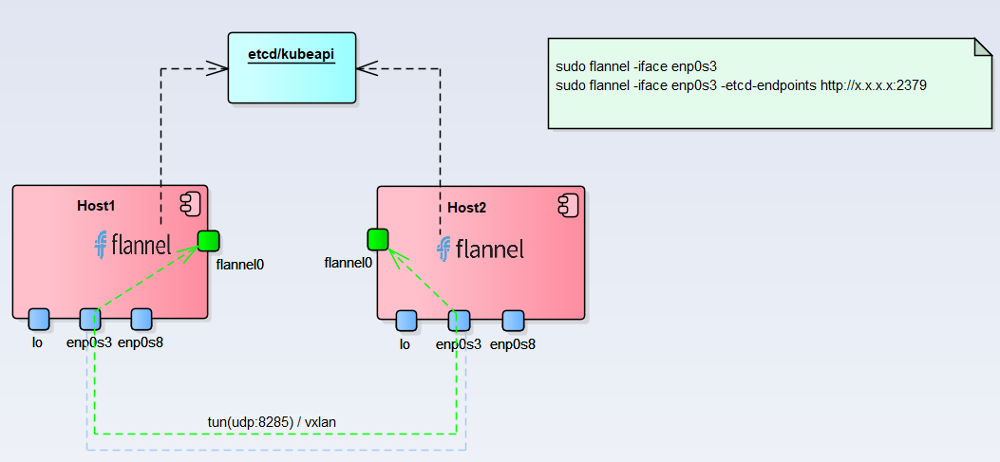
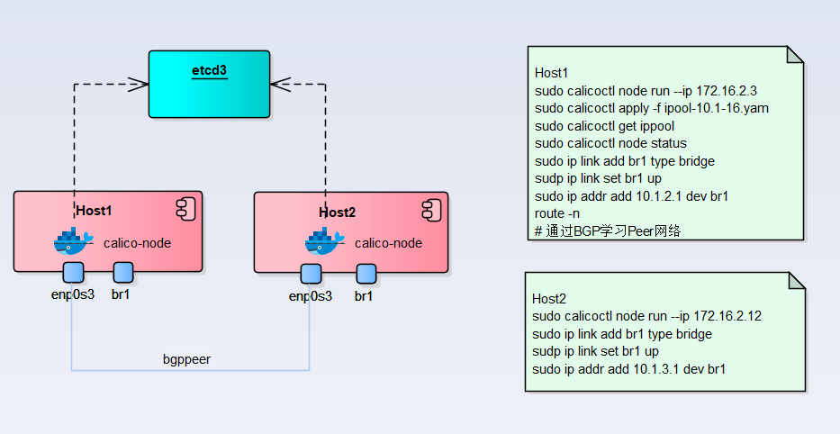

[Home](/) > [网络](network/)
# Kuberntes 网络

跨主机网络实现方式：
* 构建overlay网络
    * UDP backend
    * VxLAN backend
    * IP-IP backend
* 通过路由方案解决

## Flannel
Flannel 通过`udp`或者`vxlan`构建`overlay`网络

https://github.com/coreos/flannel   
https://github.com/coreos/flannel/blob/master/Documentation/backends.md  
[源码分析](program/code/flannel)

## Calico
Calico 提供基于路由的跨主机方案，同时支持基于`IP-in-IP`和`VxLAN`封装的`overlay`网络
* `confd` 提供配置的自动更新
* `bird` 提供默认BGP实现(可选`gobgp`)
* `Felix` 策略和管理

### Bare metal Test

###     K8s Test

https://www.projectcalico.org  
https://github.com/projectcalico/calico    
https://github.com/projectcalico/node   
[源码分析](program/code/calico)

