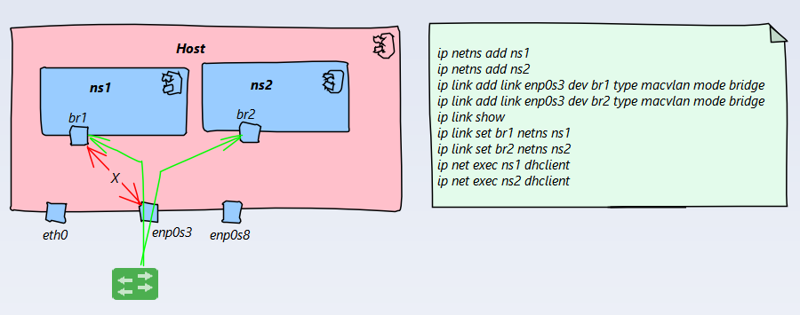

[Home](/) > [网络](network/)
# Linux 网络

## VIP（虚拟IP）
```
sudo ifconfig enp0s3:1 192.168.1.111 up
```


## Bridge
```
sudo brctl addbr bridge0
sudo brctl addif bridge0 enp0s3
sudo ip link set bridge0 up
sudo brctl show
sudo ip link set bridge0 down
sudo brctl delif bridge0 enp0s3
sudo brctl delbr bridge0
```


## VETH
```
sudo ip link add ve1 type veth peer name ve2
sudo ip link delete ve1
```

## Macvlan
Macvlan 支持`private|vepa|bridge|passthru`4种模式
### private
`private`只接受发送给自己的流量，无法与主机或外部进行通信


### vepa
VEPA（Virtual Ethernet Port Aggregator）它是HP在虚拟化支持领域对抗Cisco VN-Tag的技术

* 虚拟机与主机中需要在外部交换机的支持下进行通信
* 虚拟机无法与主机通信

### bridge
`bridge`模式处理同属于一块宿主以太网卡的虚拟网卡之间的通信，不需要再外部交换机的协助

* 虚拟机与虚拟机之间可以直接通信，无需外部交换机支持
* 虚拟机无法与主机通信

### passthru
允许绑定单一的VM到物理网卡，直接与外部通信


## Vlan
Linux Vlan 是采用基于Tag的Vlan技术，所以vlan直接的通信要能处理VLAN tags，并设置端口Trunk模式

## VXLAN
VXLAN (Virtual eXtensible Local Area Network) 是一个tunnuling的协议，用来解决802.1q的VLAN id(4096)限制问题，请参考 [IETF RFC 7348](https://tools.ietf.org/html/rfc7348)
## IPVALN
## VCAN
VCAN (Virtual Controller Area Network) driver 提供一个VCAN接口，用户可以通过接口发送/接受CAN数据，详细参考[kernel CAN documentation](https://www.kernel.org/doc/Documentation/networking/can.txt)

## VXCAN
## IPOIB
IPOIB (IP-over-InfiniBand),详细参考[IPOIB kernel documentation](https://www.kernel.org/doc/Documentation/infiniband/ipoib.txt)
` ip link add ib0 type ipoib mode connected`

## Dummy
Dummy interface是一个虚拟的接口类似loopbak，Dummy目的是提供packets的路由而不进行实际的转发（`通常用于测试目的`）

## IFB
详细参考[https://wiki.linuxfoundation.org/networking/ifb](https://wiki.linuxfoundation.org/networking/ifb)

## ipip,gre,sit tunnel技术
## VTI
VTI（vritual Tunnel Interface）
## VRF
VRF（vritual Routing Forwarding）

## 参考


* [Linux Networking Documentation](https://www.kernel.org/doc/html/latest/networking/index.html)
* [Introduction to Linux interfaces for virtual networking](https://developers.redhat.com/blog/2018/10/22/introduction-to-linux-interfaces-for-virtual-networking/#ipvlan)
* [TUN/TAP](https://en.wikipedia.org/wiki/TUN/TAP)
* [Linux Virtual Routing and Forwarding (VRF) ](https://www.kernel.org/doc/Documentation/networking/vrf.txt)
* [CSDN VRF的原理和实现](https://blog.csdn.net/gami1226/article/details/78188165)
* [Working with VRF on Linux](http://www.routereflector.com/2016/11/working-with-vrf-on-linux/)