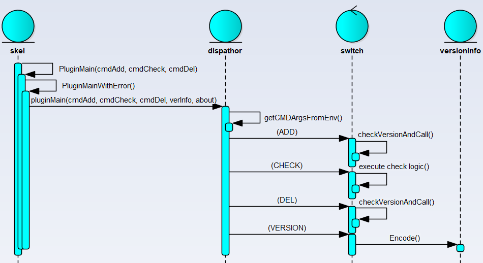

[Home](/) > [编程](program/) > [Dump into Code](program/code/)
# CNI
https://github.com/containernetworking/cni

`CNI plugin 大部分参数通过环境变量设置`
## Plugin 执行流程

## Mock Plugin
为了更好的理解`cni` plugin的基础，这里创建一个`mock` plugin来测试
### mock.conf
这里只设置必要的属性，cni会通过`stdin`获取配置
```
{
    "cniVersion":"0.4.0",
    "name":"test"
}
```
### mock.go
`mock` plugin只是为了测试不分配任何资源，所以这里简单的打印下输出
```
package main
import (
        "fmt"

        "github.com/containernetworking/cni/pkg/skel"
        "github.com/containernetworking/cni/pkg/version"
        bv "github.com/containernetworking/plugins/pkg/utils/buildversion"
)
func main() {
        skel.PluginMain(cmdAdd, cmdCheck, cmdDel, version.All, bv.BuildString("mock"))
}
func cmdAdd(args *skel.CmdArgs) error {
        fmt.Println("Init `mock` env")
        return nil
}
func cmdCheck(args *skel.CmdArgs) error {
        fmt.Println("Checking `mock` pass")
        return nil
}
func cmdDel(args *skel.CmdArgs) error {
        fmt.Println("No resources alloc of `mock` will do nothing")
        return nil
}
```
### mock_test.go
测试同样使用 [Ginkgo](https://onsi.github.io/ginkgo/) (BDD-stylec测试框架)
```
package main
import (
        "os"
        "testing"

        . "github.com/onsi/ginkgo"
        . "github.com/onsi/gomega"
)
func Test(t *testing.T) {
        RegisterFailHandler(Fail)
        RunSpecs(t, "Mock Test")
}
var _ = Describe("Mock", func() {
        BeforeEach(func() {
                os.Setenv("CNI_CONTAINERID", "test")
                os.Setenv("CNI_NETNS", "test")
                os.Setenv("CNI_IFNAME", "eth0")
                os.Setenv("CNI_PATH", ".")
                var err error
                os.Stdin, err = os.Open("mock.conf")
                Expect(err).NotTo(HaveOccurred())
        })
        //defer GinkgoRecover()
        It("test VERSION command", func() {
                os.Setenv("CNI_COMMAND", "VERSION")
                main()
        })
        It("test CHECK command", func() {
                os.Setenv("CNI_COMMAND", "CHECK")
                main()
        })
        It("test ADD command", func() {
                os.Setenv("CNI_COMMAND", "ADD")
                main()
        })
        It("test DEL command", func() {
                os.Setenv("CNI_COMMAND", "DEL")
                main()
        })
})
```
## 内置 Plugin

### Bridge

