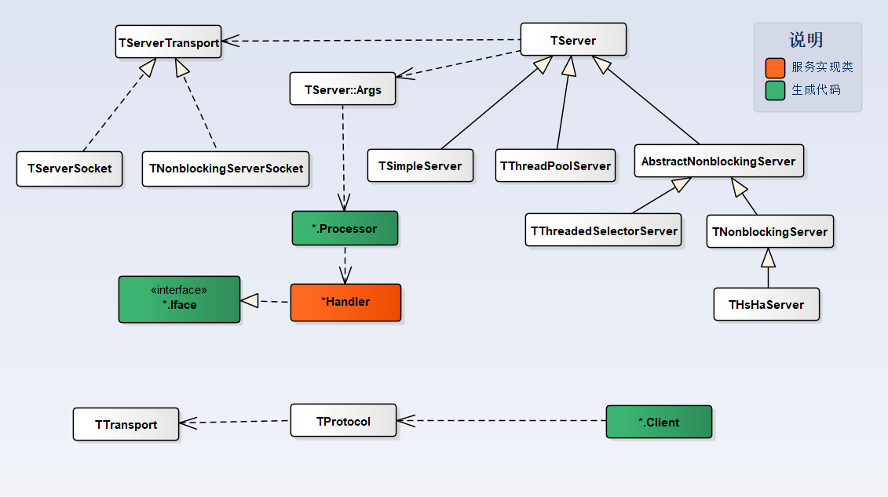

[Home](/) > [编程](program/) > [RPC 框架](program/rpc)
# Corba 模型
[Corba(Common Object Request Broker Architecture)](https://en.wikipedia.org/wiki/Common_Object_Request_Broker_Architecture)是对象管理组织([OMG](https://en.wikipedia.org/wiki/Object_Management_Group))定义的一套标准,目的是促进部署在不同平台上的系统的通信，它不仅仅是RPC技术，结合NameService进行服务的注册与查找，已经提供了分布式系统需要的大部分功能，这是一套相对比较老的技术，现在只有一些遗留的系统还在使用Corba，虽然Corba定义是可以通过多个ORB实现互相访问，但不同的语言实现的ORB直接通信总是存在各种问题，所以Corba一般都被同一中语言使用，本文以Java为例，`注意：Java 11中已经将Corba相关的包移除了，本文仅做技术参考（相信现在了解Corba的人也不多，使用的人更不多了:)）`, 参考[Java 示例](https://docs.oracle.com/javase/7/docs/technotes/guides/idl/jidlExample.html)
## IDL
Java从Java5提供Corba支持，OMG IDL的语法和语义可以参考[CORBA/IIOP 2.3.1 Specification.](https://www.omg.org/cgi-bin/doc?formal/99-10-07), Java相关Corba参考https://docs.oracle.com/javase/7/docs/technotes/guides/idl/compliance.html， IDL 到Java对象的映射关系参考[IDL to Java Mapping](https://docs.oracle.com/javase/7/docs/technotes/guides/idl/mapping/jidlMapping.html)

```idl
module org{
	module smark{
		module corba{
            interface HelloService{
			  string sayHello();
			  oneway void shutdown();
            };
		};
	};
};
```

## 代码生成器
JDK中提供了`idlj`工具来通过idl文件生成Java代码，

`idlj  -td ../ -I . -fallTIE ./hello.idl`, 通过`idlj`生产Java语言代码，`-td` 指定输出目录，`-I` 指定需要包含的`.idl`文件目录
## 序列化协议
Thrift没有纯粹的序列化对象到指定的格式，而是通过`TProtocol`的不同实现，在传输的时候进行相应的处理, 可以利用继承`TProtocolDecorator`来实现自己的数据处理：
* TBinaryProtocol 二进制数据
* TCompactProtocol 压缩数据
* TTupleProtocol Tuple处理数据
* TJSONProtocal JSON数据
* TProtocolDecorator 自定义处理
* ...

## Transport协议
Thrift使用Socket作为`Transport`, 通过`TProtocol`进行数据传输
* 基于Socket的二进制传输
* 基于Socket的压缩传输
* 基于Socket的JSON数据传输
* ...

## Corba 处理框架

### 基本类图
Thrift通过不同的`TServer`实现和`TServerTransport`实现来提供丰富的RPC功能，只要熟悉Socket编程，看Thrift的实现是非常容易。Server端`Transport`主要`TServerSocket`和`TNonblockingServerSocket`实现，处理通过一下几种TServer实现：
* TSimpleServer 一个单线程的Server（`只用于测试目的`）
* TThreadPoolServer 基于线程池的实现，可以通过Args指定自定义的线程池，否则根据Args配置默认的线程池
* TThreadedSelectorServer 基于Selector的实现，默认使用2个Selector线程，通过线程池处理逻辑，不指定情况下使用`Executors.newFixedThreadPool()`创建一个5个线程的线程池
* THsHaServer Half-Sync/Half-Async Server, [Half-Sync/Half-Async Pattern](https://java-design-patterns.com/patterns/half-sync-half-async/)


### Server 启动流程


### Client 启动流程


### 实现分析
对于有网络编程经验的人来说Thrift实现非常容易看懂，看下`TServer`对应实现类的源码就一目了然了，暂不做描述，后面抽时间补上
