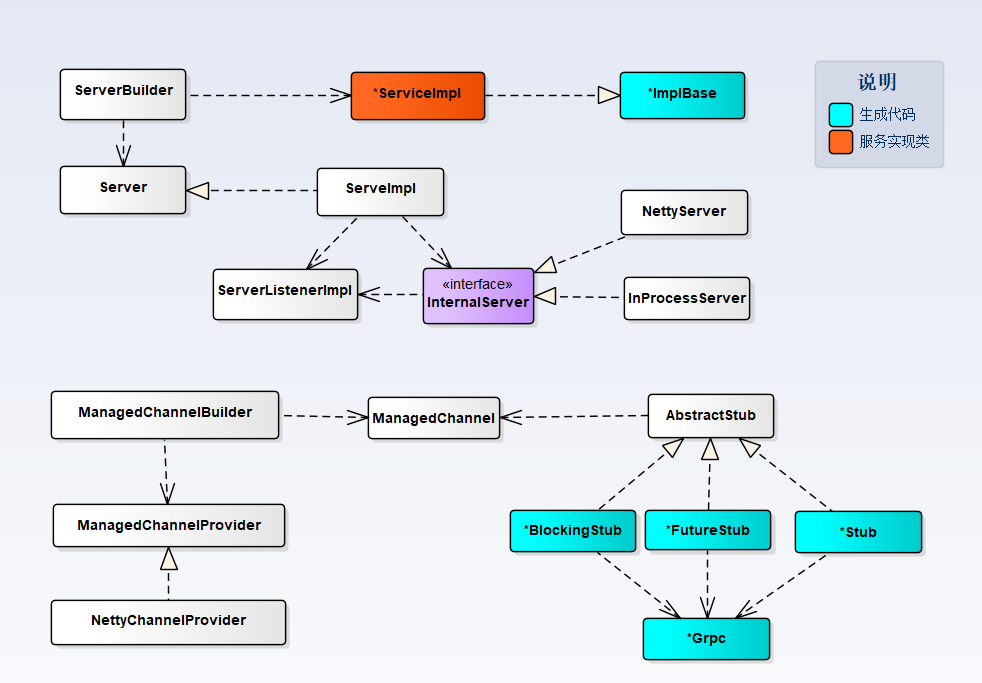
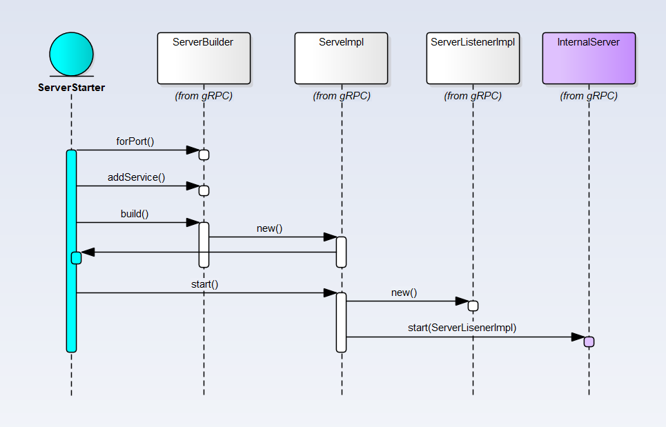
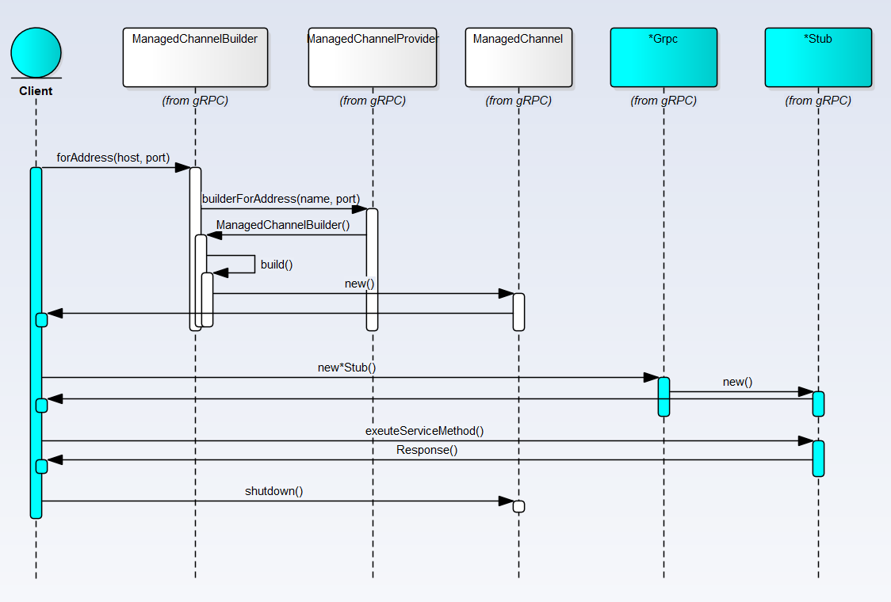

# [RPC 框架](program/rpc)
## [gRPC 模型](program/rpc-grpc)
### IDL
gRPC的采用[protobuf](https://developers.google.com/protocol-buffers/)作为IDL来描述`服务接口`和`消息结构`,如果需要，也可以使用其他替代方案。以下示例引用在[gRPC concept]([https://grpc.io/docs/guides/concepts/](https://grpc.io/docs/guides/concepts/)
)

```
service HelloService {
  rpc SayHello (HelloRequest) returns (HelloResponse);
}
message HelloRequest {
  string greeting = 1;
}
message HelloResponse {
  string reply = 1;
}
```
gRPC定义了4中可用的服务方法：
* Unary RPC  客户端发送一个单一Request并获得一个单一的Response
```
rpc SayHello(HelloRequest) returns (HelloResponse){}
```
* Server streaming RPC  Client发送一个Request到Server，然后通过获取的流来读取消息和数据，直到流中没有更多消息为止
```
rpc LotsOfReplies(HelloRequest) returns (stream HelloResponse){}
```
* Client streaming RPC Client端通过流写一个消息的序列到Server端，Client写完消息后会等待Server读取并返回Response
```
rpc LotsOfGreetings(stream HelloRequest) returns (HelloResponse) {}
```
* Bidirectional streaming RPC 也就是基于双向流的RPC
```
rpc BidiHello(stream HelloRequest) returns (stream HelloResponse){}
```

### 代码生成器
gRPC 提供protocol buffer compiler 插件产生Server端和Client端的代码：
* Java 已经提供了对应的Maven和gradle插件来生产代码，修改`.proto`文件会自动生产代码,参考[gRPC Java Code Generate]([https://github.com/grpc/grpc-java](https://github.com/grpc/grpc-java)
)描述了如何配置maven和gradle的plugin
* Golang `protoc -I . .\grpc.proto --go_out=plugins=grpc:.` 在Golang中直接通过`protoc`生产对应的golang代码，执行以上命令会产生`grpc.pb.go`文件，文件中包含了Server端和Client端需要的Go代码
* 其他语言 可以在[gRPC Tuorials](https://grpc.io/docs/tutorials)找到对应的工具信息

### 序列化协议
gRPC采用Protobuf作为序列化协议，client和server端进行数据交互的时候都回将数据序列化成protobuf格式进行传输，具体参考[protobuf](https://developers.google.com/protocol-buffers/)

### Transport协议

`基于HTTP2的二进制传输`（通过HTTP2 frame传输protobuf序列化后的二进制数据）

### gRPC 处理框架
#### Java 实现 
[https://github.com/grpc/grpc-java](https://github.com/grpc/grpc-java)

gRPC的Java实现是基于[Netty](https://netty.io/)，对于Java开发者来说这个框架会非常熟悉，这里不做多介绍。示例代码可以参考[https://grpc.io/docs/tutorials/basic/java/](https://grpc.io/docs/tutorials/basic/java/)
##### 基本类图
注意下午只画了用户在使用时需要接触的主要类，并没有列出框架实现的核心类，Server段主要通过实现`*ImpleBase`来实现真是的业务逻辑，而Client通过`*Grpc`来创建合适的`*Stub`调用定义的服务接口

##### Server 启动流程
下图描述了Server在初始化的时候的基本流程，服务端的实现类通过addService方法添加到gRPC的逻辑中提供接口的实现逻辑

##### Client 启动流程
下图描述了Client在使用的时候后的基本流程，Client通过gRPC生成的`*Stub`（Proxy）类来调用请求Server调用

##### 基于Netty的实现分析

#### Golang  实现

#### 更多实现
`用到的时候在分析了...`

