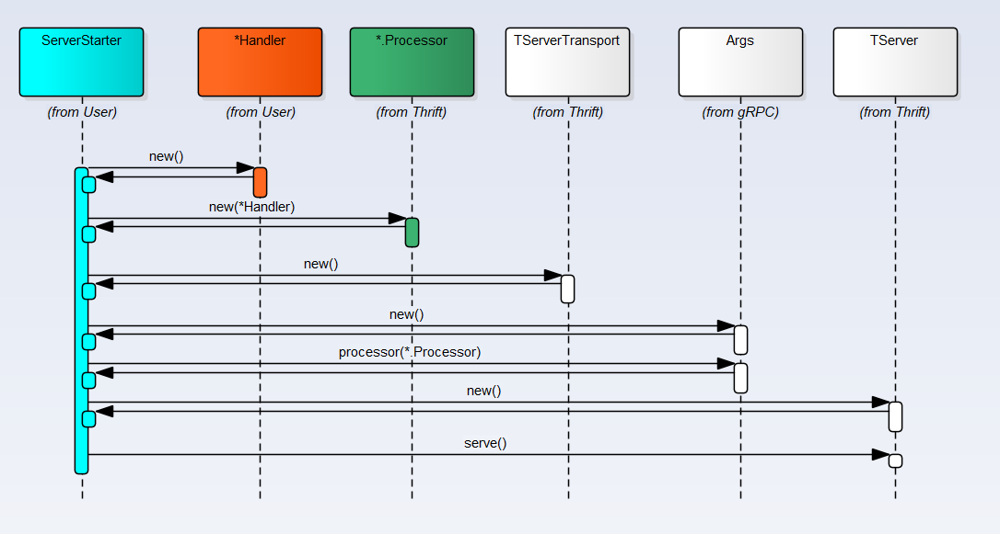
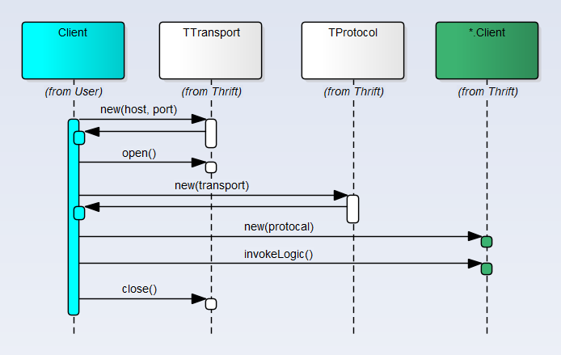

[Home](/) > [编程](program/) > [RPC 框架](program/rpc)
# Thrift 模型
## IDL

Thrift采用自定义的`.thrift`文件来定义`Service`和`结构体/消息`，参考`.thrift`文件中可以使用的[Thrift Types](https://thrift.apache.org/docs/types)，`.thrift`文档 [Thrift IDL](https://thrift.apache.org/docs/idl)
```
namespace java org.smark.thrift.test
namespace go org.smark.thrift.test
const string Hello = 'Hello'
struct User{
    1:string name,
    2:int age = 20,
    3:optional string faith
}
service HelloService{
    string hello(1:User user)
}
```

## 代码生成器
Thrift 提供了二进制的代码生成工具，可以通过以下链接下载[https://thrift.apache.org/download](https://thrift.apache.org/download)

`thrift -r -out ../ --gen java hello.thrift`, 通过`thrift`生产目标语言代码
## 序列化协议
Thrift没有纯粹的序列化对象到指定的格式，而是通过`TProtocol`的不同实现，在传输的时候进行相应的处理, 可以利用继承`TProtocolDecorator`来实现自己的数据处理：
* TBinaryProtocol 二进制数据
* TCompactProtocol 压缩数据
* TTupleProtocol Tuple处理数据
* TJSONProtocal JSON数据
* TProtocolDecorator 自定义处理
* ...

## Transport协议
Thrift使用Socket作为`Transport`, 通过`TProtocol`进行数据传输
* 基于Socket的二进制传输
* 基于Socket的压缩传输
* 基于Socket的JSON数据传输
* ...

## Thrift 处理框架

### 基本类图
Thrift通过不同的`TServer`实现和`TServerTransport`实现来提供丰富的RPC功能，只要熟悉Socket编程，看Thrift的实现是非常容易。Server端`Transport`主要`TServerSocket`和`TNonblockingServerSocket`实现，处理通过一下几种TServer实现：
* TSimpleServer 一个单线程的Server（`只用于测试目的`）
* TThreadPoolServer 基于线程池的实现，可以通过Args指定自定义的线程池，否则根据Args配置默认的线程池
* TThreadedSelectorServer 基于Selector的实现，默认使用2个Selector线程，通过线程池处理逻辑，不指定情况下使用`Executors.newFixedThreadPool()`创建一个5个线程的线程池
* THsHaServer Half-Sync/Half-Async Server, [Half-Sync/Half-Async Pattern](https://java-design-patterns.com/patterns/half-sync-half-async/)


### Server 启动流程


### Client 启动流程


### 实现分析
对于有网络编程经验的人来说Thrift实现非常容易看懂，看下`TServer`对应实现类的源码就一目了然了，暂不做描述，后面抽时间补上
